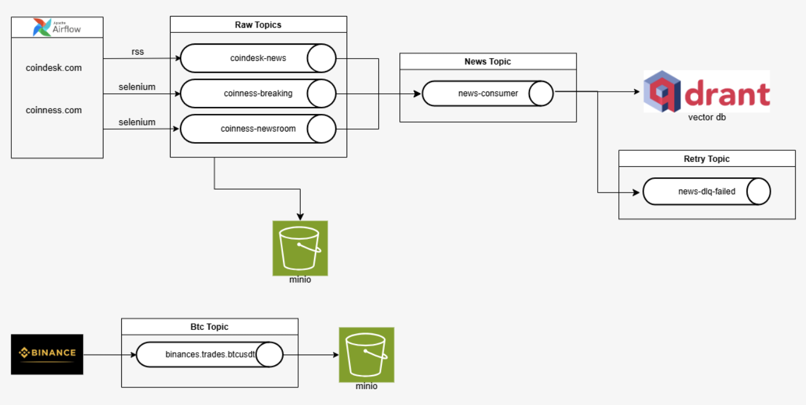
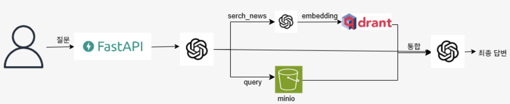
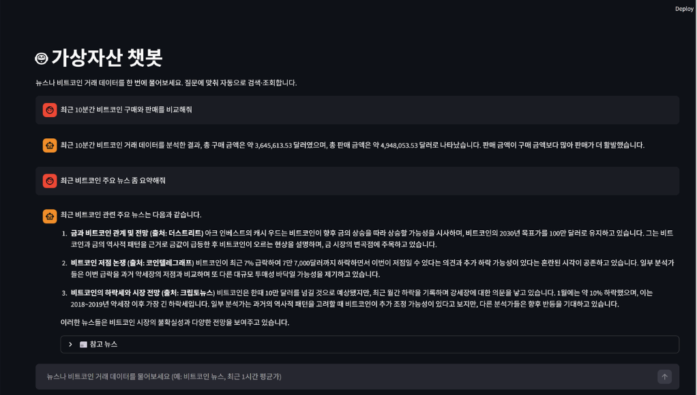
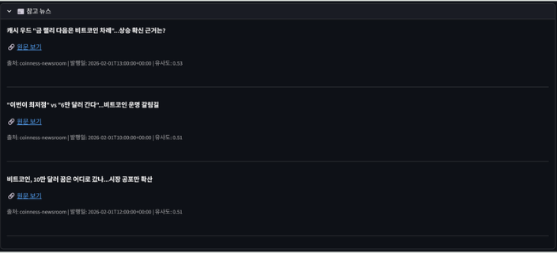

# Fin-Stream-RAG

> 가상자산 관련 실시간 뉴스와 비트코인 거래 데이터를 한 시스템에서 수집·저장·조회하고,  
> 사용자 질문 한 번에 **뉴스 검색(RAG)** 과 **거래 통계(Text-to-SQL)** 를 함께 답변하는 챗봇 파이프라인

---

## 목적

- 코인 관련 실시간 뉴스와 비트코인 거래 데이터를 단일 시스템으로 통합 수집 및 저장
- 사용자 질문 한 번으로 뉴스 검색(RAG)과 거래 통계(Text-to-SQL)를 함께 제공하는 챗봇 구현

---

## 핵심 기능

| 기능 | 설명 |
|---|---|
| **뉴스 파이프라인** | 크롤링 → Kafka → 정제/임베딩 → MinIO Parquet + Qdrant 벡터 DB |
| **거래 파이프라인** | Binance WebSocket → Kafka → MinIO Bronze/Silver Parquet |
| **통합 챗봇** | LLM이 `search_news`(RAG), `query_duckdb`(SQL) 도구를 자동 선택·호출 후 자연어 답변 + 참고 뉴스 출처 제공 |

---

## 기술 스택

### 인프라 · 미들웨어

| 기술 | 역할 |
|---|---|
| **Kafka** (KRaft) | 뉴스/거래 스트림 메시지 브로커 (Zookeeper 없음) |
| **MinIO** | S3 호환 오브젝트 스토리지 — 뉴스/거래 Parquet 데이터 레이크 |
| **Qdrant** | 뉴스 임베딩 벡터 DB (RAG 검색) |
| **Airflow** | 뉴스 크롤링 DAG 오케스트레이션 (5분 주기) |
| **Selenium (Chrome)** | CoinDesk 등 동적 페이지 크롤링 |

### 백엔드 · 프론트엔드

| 기술 | 역할 |
|---|---|
| **FastAPI** | 통합 질의 API (`/ask`), 뉴스 검색 (`/search`) |
| **Streamlit** | 챗봇 UI — API 주소 설정, 참고 뉴스 표시 |
| **OpenAI** | 임베딩(`text-embedding-3-small`), 채팅(`gpt-4o`), Function Calling |

### 데이터 · 쿼리

| 기술 | 역할 |
|---|---|
| **DuckDB** | In-Memory + httpfs로 MinIO Silver Parquet 직접 조회 (비트코인 집계) |
| **Pandas** | 컨슈머에서 Parquet 변환·저장 |
| **LangChain Text Splitter** | 뉴스 본문 청킹 (700자, 100자 overlap) |

---

## 아키텍처

### 데이터 플로우
#### 1) 뉴스 파이프라인


#### 2) 챗봇 파이프라인


```
[뉴스 파이프라인]
Airflow DAG (5분 주기)
  ├── CoinDesk 크롤러 (Selenium)
  ├── Coinness Breaking 크롤러
  └── Coinness Newsroom 크롤러
        ↓
      Kafka (coindesk-news, coinness-breaking, coinness-newsroom)
        ↓
  ┌─── news-consumer ──────────────────────────────┐
  │  정제 → MinIO news-lake/raw/**/*.parquet        │
  └────────────────────────────────────────────────┘
        ↓
  ┌─── embedding-consumer ─────────────────────────┐
  │  청킹 → OpenAI 임베딩 → Qdrant upsert          │
  │  (URL 기반 중복 체크, 실패 시 DLQ)             │
  └────────────────────────────────────────────────┘

[비트코인 거래 파이프라인]
Binance WebSocket (btcusdt@trade)
        ↓
  bitcoin_stream.py (Producer)
        ↓
  Kafka (binance.trades.btcusdt)
        ↓
  ┌─── trade-consumer ─────────────────────────────┐
  │  Bronze Layer: 원본 JSON → MinIO Parquet        │
  │  Silver Layer: 정규화 스키마 → MinIO Parquet    │
  └────────────────────────────────────────────────┘

[챗봇 플로우]
Streamlit UI
        ↓
  FastAPI POST /ask
        ↓
  GPT-4o (Function Calling)
  ├── search_news  → Qdrant 벡터 검색 → 뉴스 RAG 답변
  └── query_duckdb → MinIO Silver Parquet → DuckDB SQL → 거래 통계
        ↓
  LLM 최종 답변 + 참고 뉴스 목록
        ↓
  Streamlit UI 렌더링
```

### Silver Layer 스키마 (비트코인 거래)

| 컬럼 | 타입 | 설명 |
|---|---|---|
| `trade_id` | BIGINT | 거래 ID |
| `symbol` | VARCHAR | BTCUSDT |
| `price` | DOUBLE | 체결가 |
| `quantity` | DOUBLE | 수량 |
| `amount` | DOUBLE | price × quantity |
| `side` | VARCHAR | BUY / SELL |
| `trade_time` | TIMESTAMP | Binance 이벤트 시각 |
| `received_at` | TIMESTAMP | 수집 시각 |

---

## 디렉토리 구조

```
fin-stream-rag/
├── backend/
│   └── query_api.py                      # FastAPI 통합 질의 API
├── frontend/
│   └── app.py                            # Streamlit 챗봇 UI
├── kafka_fin/
│   ├── producer/
│   │   ├── coindesk_news_crawler.py      # CoinDesk 크롤러
│   │   ├── coinness_breaking_crawler.py  # Coinness Breaking 크롤러
│   │   ├── coinness_newsroom_crawler.py  # Coinness Newsroom 크롤러
│   │   └── bitcoin_stream.py             # Binance WebSocket → Kafka
│   └── consumer/
│       ├── news_refine_stream_pandas.py  # 뉴스 정제 → MinIO
│       ├── bitcoin_trade_stream.py       # 거래 Bronze/Silver 적재
│       └── news_embedding_stream.py      # 임베딩 → Qdrant
├── dags/
│   ├── news_crawling_dag.py              # 5분 주기 크롤링 DAG
│   └── minio_to_qdrant_embedding.py      # 배치 임베딩 DAG
├── rag_pipeline/
│   └── ingest_parquet_to_qdrant.py       # MinIO Parquet → Qdrant 배치 적재
├── docker-compose.yml
├── Dockerfile-airflow
├── Dockerfile-consumer
├── requirements-docker.txt
├── requirements-local.txt
└── .env.example
```

---

## 실행 방법

### 1. 환경 변수 설정

```bash
cp .env.example .env
# .env에서 OPENAI_API_KEY 등 필수 값 입력
```

### 2. 전체 스택 실행

```bash
docker-compose up -d
```

### 3. 서비스 접속

| 서비스 | 주소 | 비고 |
|---|---|---|
| Streamlit 챗봇 | http://localhost:8501 | 메인 챗봇 UI |
| FastAPI Docs | http://localhost:8000/docs | REST API 문서 |
| Airflow | http://localhost:8080 | DAG 모니터링 |
| Kafka UI | http://localhost:8082 | 토픽/메시지 모니터링 |
| MinIO Console | http://localhost:9001 | `admin` / `password123` |
| Qdrant Dashboard | http://localhost:6333/dashboard | 벡터 DB 현황 |
| Spark Master | http://localhost:8083 | Spark 클러스터 현황 |

---
## 최종 결과

#### 1) 답변


#### 2) 출처


## 이슈 및 해결 과정

### 1. DuckDB·MinIO 동시 접근 이슈

**문제**  
초기 설계에서 DuckDB를 저장소로 사용하려 했으나, trade-consumer(쓰기)와 백엔드(읽기)가 동시에 DuckDB에 접근하면 Lock 충돌이 발생함.

**원인**  
DuckDB는 단일 프로세스 파일 DB로, 동시 쓰기/읽기를 지원하지 않음.

**해결**  
- **저장(쓰기)**: trade-consumer → MinIO Parquet (DuckDB 미사용)
- **조회(읽기)**: 백엔드 요청마다 In-Memory DuckDB 세션을 새로 생성, httpfs로 MinIO Parquet만 읽어서 집계

**결과**  
저장과 조회가 서로 다른 자원(MinIO vs DuckDB 메모리 세션)을 사용해 충돌 없이 동시 동작 가능.

---

### 2. 뉴스·임베딩 중복 적재 이슈

**문제**  
주기 크롤링 또는 파이프라인 재실행 시 같은 기사가 반복 임베딩·적재되어 OpenAI API 비용 낭비 및 Qdrant 중복 저장 발생.

**원인**  
멱등 키 없이 파이프라인을 재실행하면 동일 URL 기사가 다시 처리됨.

**해결**  
- Qdrant에 `url` Payload Index 생성
- 적재 전 URL 존재 여부 조회 → 이미 있으면 임베딩·적재 스킵

**결과**  
임베딩 API 비용 절감, 재실행 및 오류 시에도 멱등하게 동작.

---

### 3. 챗봇에서 뉴스·거래 동시 질의 대응

**문제**  
"요즘 뉴스랑 비트코인 평균가 같이 알려줘"처럼 한 문장에 뉴스(Qdrant)와 거래(MinIO/DuckDB)가 섞인 질문 처리 필요.

**원인**  
데이터 소스와 API가 달라, 코드로만 분기하면 복잡하고 확장이 어려움.

**해결**  
`search_news`, `query_duckdb` 두 함수를 OpenAI Function Calling 도구로 등록.  
GPT-4o가 질문 의도에 따라 하나 또는 둘 다 호출하도록 위임.

**결과**  
단일 엔드포인트(`/ask`)에서 뉴스/거래 자동 분기. 새 데이터 소스는 도구 추가만으로 통합 가능.

---

## 구현 완료 기능

- **뉴스**: CoinDesk·Coinness 크롤링, Kafka 수집, MinIO Parquet 저장, Qdrant 벡터 검색, RAG 답변 + 참고 뉴스 출처
- **비트코인**: Binance 실시간 체결 → Kafka → MinIO Bronze/Silver, DuckDB 집계 쿼리(평균가·거래량 등) → 자연어 답변
- **챗봇**: 한 질문에 뉴스·거래 모두 대응하는 통합 `/ask` API, Streamlit UI, 참고 뉴스 표시

## 기술적 성과

- **RAG + Text-to-SQL 통합**: 단일 엔드포인트에서 Function Calling으로 뉴스 검색과 숫자 집계를 함께 처리
- **데이터 레이크 구조**: 뉴스·거래 각각 MinIO Parquet, Bronze/Silver 구분으로 원본 보존·정제 분리
- **비용·안정성**: URL 중복 체크로 임베딩 비용 절감 및 중복 적재 예방, DLQ로 실패 격리
